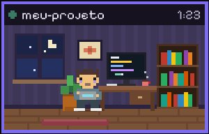
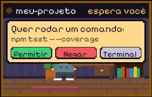
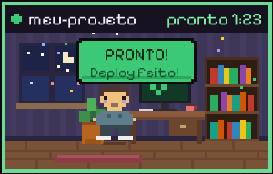

# CmdCrew

**Uma equipe de bichinhos em pixel art que trabalha junto com o Claude Code e avisa quando ele termina.**

Enquanto o Claude Code pensa, edita e roda comandos, a equipe trabalha na sua tela. Quando ele termina, ela comemora e avisa. Se ele precisar de você, ela chama. Assim você pode fazer outra coisa e saber, só de bater o olho, quando é hora de voltar.

Windows · Claude Code · grátis e de código aberto (MIT) · 100% local, sem conta e sem telemetria.

[Site](https://serignolli.com/cmdcrew) · [Baixar](https://github.com/Serignolli/cmdcrew/releases/latest/download/CmdCrew-Setup.exe) · [Supporters Pack](#supporters-pack)



## Dois jeitos de ver a equipe

### Salas

Cada terminal do Claude Code que está trabalhando ganha uma **salinha temática no canto da tela**, logo acima da barra de tarefas, com o agente trabalhando dentro.

- Mostra o nome da pasta do projeto e um cronômetro.
- **Permissões na sala:** quando o Claude pede para rodar um comando ou mexer num arquivo, a sala mostra o pedido com **Permitir**, **Negar** e **Terminal**. A pergunta de sempre continua no terminal, então dá para responder onde for mais prático.
- **Duplo clique** numa sala traz o terminal dela para a frente.
- Quando termina: letreiro **PRONTO!**, confete e um som. A sala fica alguns segundos na tela (você escolhe quantos) e sai.
- Se a resposta falhar, a sala fica vermelha e toca outro som.
- Dá para mudar o tamanho, escolher o canto (direito ou esquerdo) ou arrastar a faixa para onde quiser.

| Trabalhando | Precisa de você | Pronto |
|---|---|---|
|  |  |  |

### Equipe

Os bichinhos **andam em cima da janela do terminal**: martelam, cavam, carregam coisas e falam besteira em balõezinhos. Eles seguem a janela quando você a arrasta e somem quando o Claude termina. O spinner do terminal ("Thinking…") também passa a usar as frases da equipe.

Dá para usar um modo, o outro ou os dois ao mesmo tempo.

## Instalar

1. Baixe o **[CmdCrew-Setup.exe](https://github.com/Serignolli/cmdcrew/releases/latest/download/CmdCrew-Setup.exe)**.
2. Abra, escolha a equipe e onde ela aparece, e clique em **Instalar**. Não precisa de administrador.
3. Reinicie as sessões abertas do Claude Code.

Ele se instala em `%LOCALAPPDATA%\Programs\CmdCrew`, cria o atalho **CmdCrew** no menu Iniciar (a tela de configuração) e aparece em **Aplicativos instalados** do Windows, que é por onde se desinstala.

> O Windows pode mostrar "o Windows protegeu o computador" porque o executável não é assinado. Se preferir, compile você mesmo a partir do código (veja abaixo): é o mesmo programa.

## Personagens

Todos estes vêm de graça, cada um com várias cores:

| Categoria | Personagem | Trabalho |
|---|---|---|
| Fábrica de Chocolate | Oompa-Loompas | martelam e cantam (♪) |
| Programação | Programadores (dev cansado, dev cansada, gamer, hacker) | digitam no notebook |
| Fantasia | Dragão | voa em cima do terminal e cospe fogo |
| Fantasia | Elfos | atiram flechas |
| Outros | Gnomos mineiros | picaretam (faíscas) |
| Outros | Robozinhos, robôs clássicos | soldam, apitam, aspiram |
| Animais | Gatos, cachorros, pinguins, formigas | cochilam, latem, gelam o processador, carregam folhas |
| Claude | Clawd e as estrelinhas do Claude | digitam e soltam estrelinhas ✻ |

Temas de sala: **Escritório do dev** e **Mina dos anões**.

Cada personagem é um arquivo JSON em [`personagens/`](personagens), com o desenho em texto (cada letra é uma cor da skin, `.` é transparente). Dá para criar o seu: copie um arquivo, troque o `id` e edite os desenhos.

## Supporters Pack

O CmdCrew é e continua grátis. Para quem quiser apoiar o projeto, existe o **Supporters Pack**: personagens de fantasia e RPG em alta definição, desenhados quadro a quadro, com mais animações.

- **Anões mineiros HD**: picam pedra, empurram o carrinho e carregam o saco. Também assumem a sala da mina.
- **Gnomos de jardim HD**: regam, cavam e rastelam.
- E mais a caminho: elfos, dragão, magos, cavaleiros...

O pack chega como um `.zip`. Para instalar, abra a configuração e clique em **Adicionar pacote…**. Os personagens do pack não fazem parte deste repositório.

## Privacidade e o que muda no seu Claude Code

- Tudo roda no seu computador. Não há conta, servidor ou telemetria.
- O instalador adiciona **ganchos (hooks)** ao `~/.claude/settings.json`: `UserPromptSubmit`, `Notification`, `PermissionRequest`, `PostToolUse`, `Stop`, `StopFailure` e `SessionEnd`. Se você quiser, ele também troca as frases do spinner (`spinnerVerbs` e `spinnerTipsOverride`).
- Antes da primeira alteração ele faz um backup: `settings.json.antes-cmdcrew.bak`.
- O gancho `PermissionRequest` só decide algo quando você clica em **Permitir** ou **Negar** na sala. Sem clique, ou com **Terminal**, o Claude Code segue com a pergunta normal. Isso pode ser desligado na configuração.
- Desinstalar tira todos os ganchos e devolve as frases originais.

## Para quem desenvolve

Não precisa instalar nada: o executável é compilado com o compilador C# que já vem no Windows (.NET Framework 4).

| Arquivo | O que faz |
|---|---|
| `instalar.cmd` | compila e liga os ganchos usando esta pasta (eles apontam para `bin\CmdCrew.exe`) |
| `configurar.cmd` | abre a configuração |
| `testar.cmd` | mostra três salas de demonstração (uma pede permissão, outra falha) |
| `desinstalar.cmd` | tira os ganchos do Claude Code |
| `src\build.ps1` | só compila: `bin\CmdCrew.exe` e `dist\CmdCrew-Setup.exe` |

Nesse modo, o caminho do executável fica gravado nos ganchos. Se mover a pasta, rode `instalar.cmd` de novo.

### Estrutura

```
src/              código C# (WinForms)
  Program.cs        comandos e ganchos (start, wait, permission, tool, stop, fail, end)
  Sessions.cs       estado de cada sessão do Claude Code (%LOCALAPPDATA%\CmdCrew\sessoes)
  Strip.cs          a faixa de salas no canto da tela, sons e cliques
  Rooms.cs          os temas das salas e o agente trabalhando dentro
  Overlay.cs        a equipe em cima do terminal
  ConfigForm.cs     a tela de configuração
  SetupForm.cs      o assistente de instalação (Installer.cs copia e registra)
  recursos/         fonte Pixelify Sans, ícone e sons
personagens/      personagens gratuitos (JSON), embutidos no instalador
site/             o site (HTML/CSS/JS estático, publicado na Vercel)
ferramentas/      scripts Python: gerar o site, os GIFs e os personagens
```

### Comandos úteis

```
bin\CmdCrew.exe demo-salas 3 10        salas de demonstração
bin\CmdCrew.exe demo 12                equipe de demonstração em cima da janela ativa
bin\CmdCrew.exe shot mina pronto x.png sala renderizada num PNG (para conferir desenhos)
bin\CmdCrew.exe sheet folha.png        todos os personagens, skins e quadros numa folha
python ferramentas/gerar_site.py       atualiza site/dados.js com os personagens gratuitos
python ferramentas/gerar_gifs.py       atualiza os GIFs do site (precisa do supporters-pack/)
```

### Publicar uma versão

Crie uma tag `v*` (por exemplo `git tag v1.0.0 && git push --tags`). O workflow `release.yml` compila no Windows e publica o `CmdCrew-Setup.exe` na release. O site sempre aponta para `releases/latest`.

## Créditos

- Sons feitos no SFX Forge.
- Fonte [Pixelify Sans](https://fonts.google.com/specimen/Pixelify+Sans) (SIL Open Font License).

Desenvolvido por [Serignolli](https://serignolli.com). Licença [MIT](LICENSE).
